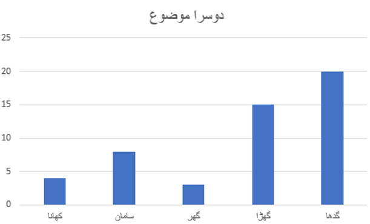

# 
Latent Dirichlet Allocation

###### 
Johann Peter Gustav Lejeune Dirichlet   اٹھارویں صدی عیسوی میں جرمنی سے تعلق رکھنے والا ایک ریاضی دان تھا جس کی جدید ریاضی کے لیے بہت سی  خدمات ہیں۔ اور اسی کے نام پہ   Dirichlet Allocation   کا نام رکھا گیا ہے ۔ یہ امکان یا ممکنات (Probability) معلوم کرنے کا کلیہ (Algorithm) ہے  اور  Latent Dirichlet Allocation اسی ریاضی دان کے نام  سے ماخوذ ہے ۔ اور سنہ 2003 میں پہلی مرتبہ LDA  کو ایک Machine Learning کے جریدے میں  موضوعات کھوجنے والے اس ماڈل کو  تصویری صورت میں پہلی مرتبہ شایع کیا گیا

### Latent Dirichlet Allocation (LDA) 
###### 
ہمیں LDA  کو سمجھنے کے لیے چند چیزیں فرض کرنی ہوں گی

###### 
-	کسی بھی مواد میں موجود اگر دو یا دو سے زیادہ دستاویزات  کے موضوع باہم مماثل ہوں تو یہ یقینی طور پہ ان دستاویزات میں الفاظ بھی کم و بیش مشترک ہوں گے

###### 
-	مواد میں موجود کسی ایک دستاویز میں ایسے الفاظوں کے مجموعہ (جو تواتر سے ساتھ آرہے ہیں) کی جانچ کرنے سے ہمیںLatent Topic معلوم ہو سکتا ہے یعنی وہ موضوعات جن کا ذکر زیادہ ہے یا جن پہ یہ دستاویز زیادہ بات کررہی ہے۔

###### 
مثال :  اگر کسی دستاویز کا موضوع کرکٹ ہے تو اس میں موجود الفاظوں کا مجموعہ کچھ اس طرح سکتا ہے ۔ باؤلنگ، بیٹنگ، فیلڈنگ، کرکٹر، کپتان وغیرہ

###### 

###### 
پھر اگر اوپر کے دو مفروضے فرض کرلیے جائیں تو پھر ہمارے لیے نیچے کی دو عبارتوں کو فرض کرنا بھی آسان ہوجاتا ہے 

###### 
-	دستاویزات دراصل موضوعات latent topics  کے اوپر ممکنہ منقسم  probably distribution ہوتی ہیں

###### 
-	اور موضوعات بذات خود الفاظوں کے اوپر ممکنہ منقسم  probably distribution  ہوتے ہیں

###### 

###### 
نیچے کی تصویر میں ایک دستاویز کو دکھایا گیا ہے کہ اس میں ـ دوسرے موضوع ـ کی    probability   یعنی امکانیات زیادہ ہے ، گو کہ اس میں دیگر موضوعات (پہلا موضوع، تیسرا موضوع وغیرہ۔۔۔) بھی موجود ہیں ۔ لہذہ ہر دستاویز میں کچھ نا کچھ موضوعات مخفی ہوتے ہیں اور کچھ کے امکانات زیادہ ہوتے ہیں اور کچھ کے کم ۔ یاد رہے کہ ابھی بھی ہم وثوق سے یہ نہیں کہہ سکتے کے نیچے دی گئی دستاویز کا موضوع (دوسرا موضوع ہی ہے) بلکہ ہم فقط یہ کررہے ہیں کہ ہم ہر ڈاکومنٹ میں مخفی موضوعات کے امکانات probability نکال رہے ہیں جو کہ اسی طرح آئے گی جیسے کی نیچے کی تصویر بتا رہے ہیں ۔

###### 

###### 
اور انہیں خطوط پہ ہم کسی بھی موضوع میں چھپے الفاظوں کے مجموعے کی بھی امکانیات probability نکالتے ہیں ۔ جیسا کہ نیچے دی گئی تصویر سے ہمیں یہ سمجھنے میں مشکل نہیں ہوگی کہ دوسرے موضوع میں لفظ سامان لفظ کھانا وغیرہ کی ممکنات کم ہیں لیکن لفظ گھوڑا اور گدھا کی Probability  زیادہ ہے۔  

###### 
لہذاس نہج پہ پہنچ کر ہم بحیثیت  صارف ، یہ سمجھنے کی کوشش کرتے ہیں کہ کوئی خاص موضوع  کس چیز کی نمائندگی کررہا ہے

###### 
اگر ہم اس طریقے پہ کسی بھی مواد میں موجود تمام دستاویزات کے تمام موضوعات، اور ہر موضوع کے تمام کے تمام ممکنہ الفاظ کو کو حاصل کرلیتے ہیں ، جو کہ اوپردرج کی گئی تکنیک LDA کے ذریعے سے ہوگا تو پھر ہم بحیثیت  صارف اپنی مشین سے یہ سوال کرنے کے قابل ہوجائیں گے کہ ۔ مجھے کسی موضوع (مثال کے طور پہ سیاست) کے سب سے زیادہ ممکنہ  (top 10) دس الفاظ لا کر دو ۔ اس کے بعد ہم نتیجہ اخذ کرنے کی کوشش کریں گے کہ اس لفظ کا اصلی مخفی موضوع کیا تھا۔ جیسا کہ اوپردی گئی تصویر میں ہم یہ اخذ کرسکتے ہیں کہ دوسرا موضوع دراصل کہیں نہ کہیں Travel سے متعلق ہے ۔ 

###### 
یاد رہے کہ LDA کی تکنیک ہمیں براہ راست یہ نہیں بتا سکتی ہے ۔ بلکہ یہ اخذ کرنا صارف کا کام ہے کہ اس موضوع کا تعلق Travel سے ہے

###### 
اور ہم جب python  میں کوڈنگ کریں گے تو ہم اس بات کا براہ راست تجربہ کریں گے

###### 

###### 

- [Main Page](README.md)
- [LDA Example](lda-source.md)
